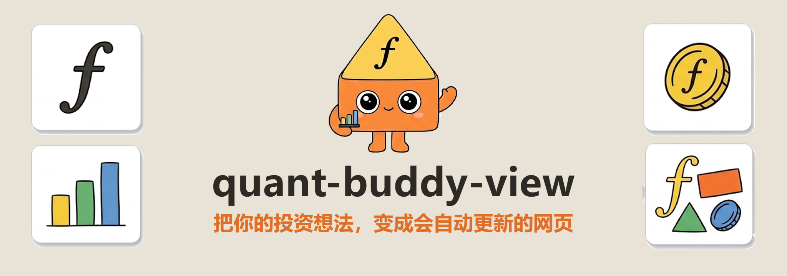
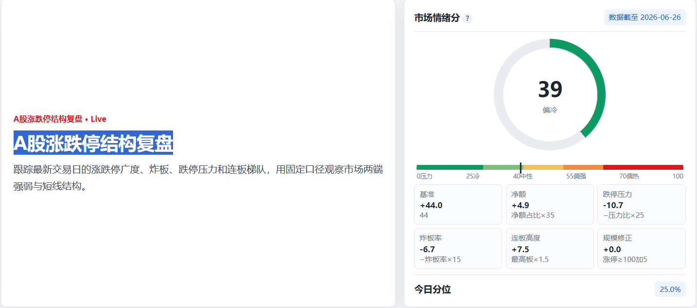
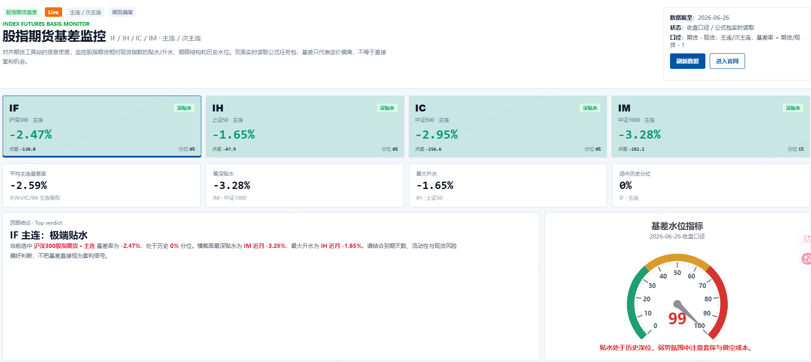
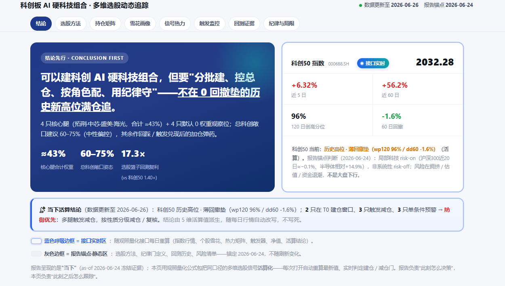
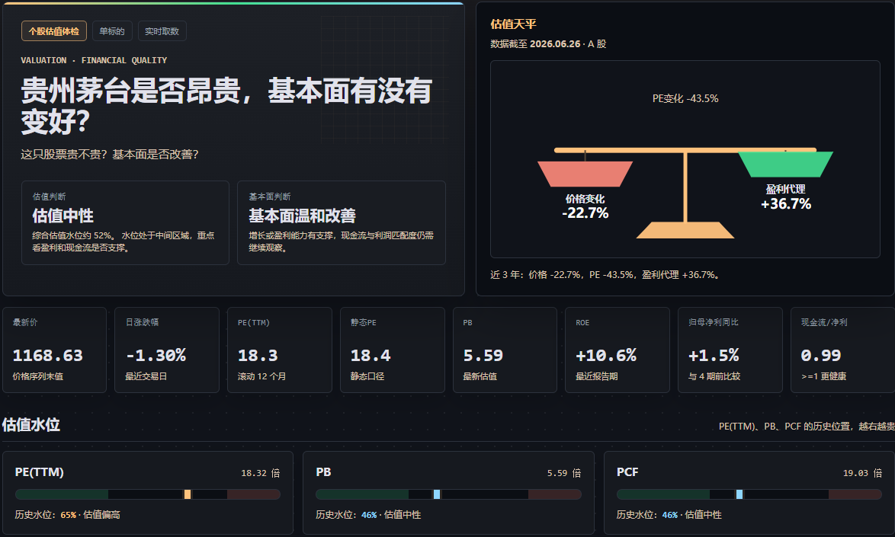
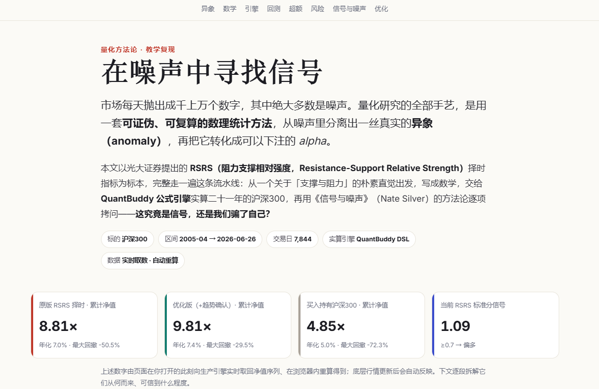
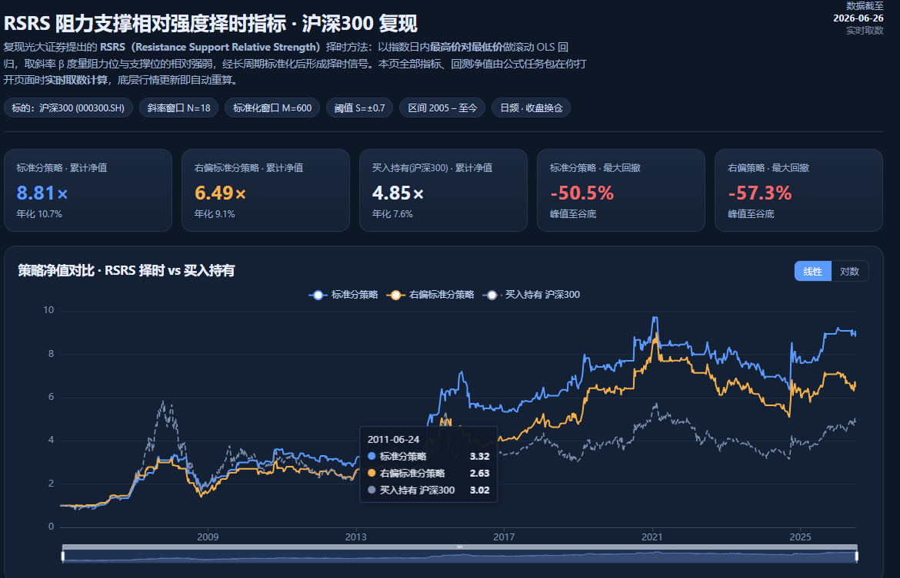

# quant-buddy-view

<p align="center">
  
</p>

<p align="center">
  <a href="README.md">中文</a> ·
  <a href="README.en.md">English</a> ·
  <a href="https://www.quantbuddy.cn">Website</a> ·
  <a href="https://www.quantbuddy.cn/templates">Template Market</a> ·
  <a href="https://tcn8bvcbyokw.feishu.cn/wiki/E1zswck3oiiJjJkP07QcmSG3nle?from=from_copylink">Tutorial</a>
</p>

<p align="center">
  <a href="https://github.com/pseudo-longinus/quant-buddy-view/stargazers"></a>
  <a href="https://github.com/pseudo-longinus/quant-buddy-view/blob/main/LICENSE"></a>
  
  
</p>

## 🔥 Install in 3 Seconds

If you already use an AI Agent tool (Claude Code, Cursor, OpenClaw, …), just tell the agent:

> Install this skill for me:

```bash
npx skills add pseudo-longinus/quant-buddy-view -g -a claude-code -s quant-buddy-view -y
```

New to agents and skills? Follow the [step-by-step illustrated tutorial](https://tcn8bvcbyokw.feishu.cn/wiki/E1zswck3oiiJjJkP07QcmSG3nle?from=from_copylink).

---

> **Turn your investment ideas into web pages that update themselves.**  
> Describe the question you want to track, and [QuantBuddy](https://www.quantbuddy.cn) turns it into a shareable, self-updating research dashboard.

quant-buddy-view is the **dashboard-publishing layer** of the QuantBuddy family. It does **not** look up quotes or run backtests — that's the job of [quant-buddy-skill](https://github.com/pseudo-longinus/quant-buddy-skills). It takes the indicators you've already explored and validated and turns them into a **public, shareable web dashboard that re-computes automatically whenever the underlying data changes**.

From idea to dashboard in three steps:

| 1. You bring the idea | 2. QuantBuddy computes | 3. The page goes live |
|---|---|---|
| "Screen for high-dividend, low-valuation stocks" | Auto-matches data, indicators and formulas, registers them as a formula package | Generates a shareable live dashboard and a public link |

The page is **alive**: when the data changes, the page changes with it. No re-screenshotting, no re-exporting tables — the formula package behind the page recomputes on schedule, so every visitor sees today's latest values on open, with **no backend and no API key in the frontend**.

> This project is for financial data analysis, quantitative research, strategy validation and educational use only. It is not investment advice, trading advice, a performance guarantee, or an automated-trading service.

## See the Official Picks

Every page below is an **official pick from the [QuantBuddy Template Market](https://www.quantbuddy.cn/templates)** (served live over the API). For each one you can **preview the sample → download the template HTML / copy the prompt → hand it to your Agent to reuse**, swapping in your own tickers / copy / formula package to get your own dashboard. Most are "alive": pure static HTML, no backend, no database — on open they `fetch` a formula package and render it, and refresh shows today's latest values.

| Official pick | Category | Type | One-liner | Open |
|---|---|---|---|---|
| A-Share Limit-Up/Down Structure Review | 📈 Market / limit-up-down | Live · 1 pkg | Limit moves, failed-board rate, consecutive-board ladder, sentiment | [Preview](https://pages.quantbuddy.cn/pages/page_221a3ffae084d983d1b509d4.html) |
| Index Futures Basis Monitor (front/next month) | 📈 Market / futures & derivatives | Live · 1 pkg | IF/IH/IC/IM discount/premium, basis percentiles, term structure | [Preview](https://pages.quantbuddy.cn/pages/page_1256a77743fab9aa39838ce9.html) |
| Kweichow Moutai · Valuation Check-up | 🔍 Asset / valuation & financials | Live · 1 pkg | Is this stock expensive, are the fundamentals improving | [Preview](https://pages.quantbuddy.cn/pages/page_d4ca42720380d1b5bc3207c0.html) |
| STAR-Market AI Hard-Tech Portfolio · Multi-Factor Tracker | 📦 Portfolio / thematic | Live · 3 pkg | Index state + candidate weights + backtest + signal heatmap + alerts | [Preview](https://pages.quantbuddy.cn/pages/page_4b488204774ddb45739d39cc.html) |
| Finding Signal in the Noise · RSRS Timing Reproduced | 🔬 Research / methodology | Live · 1 pkg | Full timing workflow: high/low regression → standardized signal → sizing | [Preview](https://pages.quantbuddy.cn/pages/page_c0c1e05bdad501fbb40641a3.html) |
| RSRS Relative-Strength Timing · CSI 300 Reproduction | 🎯 Strategy / timing & backtest | Live · 1 pkg | Z-score, right-skew correction, equity curve, vs buy-and-hold, drawdown | [Preview](https://pages.quantbuddy.cn/pages/page_d5ba93c6930902fdfa8b6f98.html) |

> 👉 Or browse them all, download the template HTML, or copy the prompt in the [Template Market](https://www.quantbuddy.cn/templates). Count and contents are whatever the site returns at the time.

<table align="center">
  <tr>
    <td align="center" width="50%">
      <a href="https://pages.quantbuddy.cn/pages/page_221a3ffae084d983d1b509d4.html"></a>
      <br/><sub><b>A-Share Limit-Up/Down Structure Review</b> · Market</sub>
    </td>
    <td align="center" width="50%">
      <a href="https://pages.quantbuddy.cn/pages/page_1256a77743fab9aa39838ce9.html"></a>
      <br/><sub><b>Index Futures Basis Monitor</b> · Market</sub>
    </td>
  </tr>
  <tr>
    <td align="center" width="50%">
      <a href="https://pages.quantbuddy.cn/pages/page_4b488204774ddb45739d39cc.html"></a>
      <br/><sub><b>STAR-Market AI Hard-Tech Portfolio</b> · Portfolio</sub>
    </td>
    <td align="center" width="50%">
      <a href="https://pages.quantbuddy.cn/pages/page_d4ca42720380d1b5bc3207c0.html"></a>
      <br/><sub><b>Kweichow Moutai · Valuation Check-up</b> · Asset</sub>
    </td>
  </tr>
  <tr>
    <td align="center" width="50%">
      <a href="https://pages.quantbuddy.cn/pages/page_c0c1e05bdad501fbb40641a3.html"></a>
      <br/><sub><b>Finding Signal in the Noise · RSRS</b> · Research</sub>
    </td>
    <td align="center" width="50%">
      <a href="https://pages.quantbuddy.cn/pages/page_d5ba93c6930902fdfa8b6f98.html"></a>
      <br/><sub><b>RSRS Timing · CSI 300 Reproduction</b> · Strategy</sub>
    </td>
  </tr>
</table>

> ⚠️ All shown are **template previews**; figures are historical / sample data and are **not investment or trading advice**.

## Public Templates to Reuse — or Build Your Own

### Template Market: official picks, open and reuse

The truly reusable public templates live in the [QuantBuddy Template Market](https://www.quantbuddy.cn/templates) — **official picks served live over the API** (not files hard-coded into this repo), the same batch [shown above](#see-the-official-picks), organized by scenario: watch the market, profile an asset, manage a portfolio, do research, track a strategy. For each template you can **"preview the sample" to check it fits your question, then "download the template HTML" or "copy the prompt" and hand it to your Agent to reuse** — swap in your own tickers / copy / formula package and you get your own dashboard.

**New official templates keep being added** — the count and contents are whatever the site and API return at the time. You can also pull / reuse templates straight from the skill, no browser needed:

```bash
python scripts/static_page.py templates                              # list official picks
python scripts/static_page.py template '{"template_id":"tpl_xxx"}'    # details, with download_url and prompt
```

### Bundled example pages (starting points, not official templates)

The `skills/quant-buddy-view/templates/` folder in this repo holds a set of **example pages** — to show what each kind of dashboard looks like and how the layout is built, so you can copy and tweak them. They are **examples and starting points, not the official templates in the market**:

| Example | What it shows |
|---|---|
| `single-stock` | Single-stock snapshot: stat cards (last / change / 20d / 60d / PE / PB / turnover) + price chart |
| `valuation-financial-profile` | Valuation check-up: PE/PB/PCF historical bands, financial trends, cash-flow quality, attribution |
| `index-anomaly` | Constituent anomaly board: anomaly ranking + up/down distribution + index sparkline (dark theme) |
| `multi-factor-screener` | Multi-factor screener: theme pool + factor scores + TopN + backtest/rankIC + candlestick + formula audit |
| `commodity-daily` | Commodity long/short daily: sector dominance + today's anomalies + top-name sparklines |
| `bubble-watch` | Bubble-watch terminal: composite "temperature" gauge + multi-market bubble levels + macro backdrop |

### Build your own page templates

For layouts that neither the public templates nor the examples can cover, **hand-craft your own page**: custom HTML / CSS / SVG, with the data layer calling the shared kernel `assets/data-kernel.js` (`QB.query` to fetch, `QB.series / lastValue / topValues` to unpack and clean), wrapped in the shared share-shell (header, footer, refresh, share poster). See `skills/quant-buddy-view/guides/bespoke-page.md`.

Once validated, a custom page can in turn **become a new public template** for others to reuse.

## The Three-Stage Flow

Core pipeline: **register formula package → build dashboard → publish link**.

```powershell
cd skills/quant-buddy-view

# 1. Register the formula package (needs API key): params.json holds formulas + reads.
#    Pass Chinese formulas via @file to avoid encoding truncation.
python scripts/formula_package.py register @params.json
#    -> returns package_id + signature, saved to output/formula_packages/<package_id>.json

# 2. Build the dashboard HTML: spec.json holds title + panels, referencing the package_id above.
python scripts/build_dashboard.py @spec.json
#    -> writes output/pages/<slug>.html (add "upload": true in spec to publish in one step)

# 3. Publish: upload the HTML and get a public shareable link.
python scripts/static_page.py upload '{"html_file":"output/pages/<slug>.html","title":"My Dashboard"}'
#    -> returns https://pages.quantbuddy.cn/...
```

Example `params.json` for registration:

```json
{
  "formulas": [
    "hs300_close = \"全市场每日收盘价\"*取出(沪深300)",
    "hs300_chg   = \"全市场每日回报率\"*取出(沪深300)"
  ],
  "reads": [
    { "output": "hs300_close", "read_mode": "range_data", "mode_params": { "lookback_days": 365 } },
    { "output": "hs300_chg",   "read_mode": "last_day_stats" }
  ],
  "ttl_days": 365
}
```

Example `spec.json` for the dashboard:

```json
{
  "title": "CSI 300 Monitor",
  "subtitle": "1-year trend · latest change",
  "package_id": "pkg_xxx",
  "panels": [
    { "title": "1-year close", "output": "hs300_close", "type": "line" },
    { "title": "Latest change", "output": "hs300_chg",  "type": "number", "unit": "%" }
  ]
}
```

> ⚠️ Every set of formulas you register **must first be validated in quant-buddy-skill via `runMultiFormulaBatchStream`** (the syntax is identical on both sides and reusable verbatim) — confirm it produces data, then `register`.

## Maintenance

- **Page already shared, want to change content but keep the link** (most common): re-run step 2 to build new HTML, then `update` to replace the same `page_id` — the URL stays, visitors see the new content on refresh, and it doesn't consume a new active-page slot.
- **Data updated, want to refresh the page**: nothing to do — the page is live, every visitor sees the latest on open.
- **Take a page down**: `python scripts/static_page.py revoke '{"page_id":"page_xxx"}'`.
- **Rotate the package signature**: `python scripts/formula_package.py refresh '{"package_id":"pkg_xxx","rotate_signature":true}'`, then rebuild the page with the new signature.

## How Live Fetching Works

A published page embeds `package_id + signature` and, on open, calls `queryFormulaPackage` (SSE streaming) to pull the latest data and render it. Two preconditions (both met by current endpoints):

1. `queryFormulaPackage` allows CORS for the page domain `pages.quantbuddy.cn`.
2. `signature` is a capability token for the formula package, designed to be embeddable in public pages.

> ⚠️ Protocols must match: the page is served over `https://`, so the `endpoint` in `config.json` must also be `https://`, or the browser blocks the fetch as mixed content.

## Installation

### npx (recommended)

We recommend installing **only to the AI Agent you actually use** — avoid `--all`.

| Your Agent | Recommended command |
|---|---|
| Claude Code | `npx skills add pseudo-longinus/quant-buddy-view -g -a claude-code -s quant-buddy-view -y` |
| Cursor | `npx skills add pseudo-longinus/quant-buddy-view -g -a cursor -s quant-buddy-view -y` |
| OpenClaw | `npx skills add pseudo-longinus/quant-buddy-view -g -a openclaw -s quant-buddy-view -y` |

Update for existing users:

```bash
npx skills update quant-buddy-view -g -y
```

On Windows, if you hit symlink or permission errors, append `--copy`:

```bash
npx skills add pseudo-longinus/quant-buddy-view -g -a claude-code -s quant-buddy-view -y --copy
```

> This project pairs with [quant-buddy-skill](https://github.com/pseudo-longinus/quant-buddy-skills): explore quotes / factors / backtests in the skill first, then use view to turn the indicators into a published dashboard. Both share the same quant-buddy API key.

## Configure the API Key

Before first use, configure a quant-buddy API key:

1. Sign up and get a key at <https://www.quantbuddy.cn/login>.
2. Edit `skills/quant-buddy-view/config.json` and fill the `api_key` field.
3. Or set the env var `QUANT_BUDDY_API_KEY` (takes precedence over config.json).
4. Or, in an agent that can write local files, send:

```text
Configure my quant-buddy API key: sk-xxxxxxxx
```

> Registering packages / publishing pages needs the API key (sent only as the `Authorization` header to declared quantbuddy domains). **Live fetching inside the dashboard needs no API key** — just `package_id + signature`.

## Runtime

- **Python 3.8+**: the core pipeline (register → build → publish) uses only the Python standard library — **no `pip install` needed**.
- **Node.js 18+ (optional)**: only required for `scripts/verify_page.mjs` (pre-publish page check).
- **`playwright` (optional)**: needed for the visual check in `verify_page.mjs`; if missing it's skipped automatically without affecting the structural check.

## Billing

Creating and refreshing dashboards is billed in **RU (resource units)**, scaling with the number of formulas, data volume and recompute complexity.

> **Currently in a free trial period**: creating and refreshing dashboards does not consume RU for now. After the free period ends, complex computations are billed in RU. Fetch costs always count against the **formula-package owner's** quota — visitors open the page with no API key and zero config. Actual usage is per your platform account page and the API responses.

## Security & Disclaimer

- The quant-buddy API key is used only to call quant-buddy platform APIs, sent solely as the HTTP `Authorization` header to declared platform domains — never logged, never forwarded to third parties.
- When self-hosting, keep the API key server-side; never put it in browser code or a public repo. The repo's `config.json` ships with an empty `api_key`; put real keys in `config.local.json` (git-ignored) or an env var.
- `signature` is a capability token for the formula package and is, by design, written into **public** HTML for live fetching; confirm the page content and its public scope before publishing.
- This project is for financial data analysis, quantitative research, strategy validation and educational use only. It is not investment advice, trading advice, a performance guarantee, or an automated-trading service.
- Backtests, screens, factors and historical data do not represent future returns.

## Contact

For more dashboard examples, integration questions, the roadmap and real research workflows, scan to add WeChat or join a group.

<p align="center">
  <table>
    <tr>
      <td align="center">
        
        <br/>
        <sub>Personal WeChat</sub>
      </td>
      <td align="center">
        
        <br/>
        <sub>WeChat group</sub>
      </td>
      <td align="center">
        
        <br/>
        <sub>Feishu group</sub>
      </td>
    </tr>
  </table>
  <br/>
  <sub>Scan to add WeChat or join a group — happy to chat about quant data dashboards, AI Agent workflows and strategy-validation cases.</sub>
</p>

## Star History

<a href="https://www.star-history.com/?repos=pseudo-longinus%2Fquant-buddy-view&type=date&legend=top-left">
 <picture>
   <source media="(prefers-color-scheme: dark)" srcset="https://api.star-history.com/chart?repos=pseudo-longinus/quant-buddy-view&type=date&theme=dark&legend=top-left" />
   <source media="(prefers-color-scheme: light)" srcset="https://api.star-history.com/chart?repos=pseudo-longinus/quant-buddy-view&type=date&legend=top-left" />
   
 </picture>
</a>

## License

MIT
