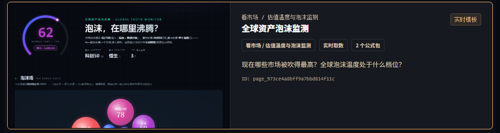
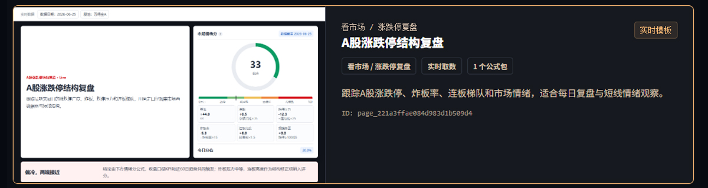
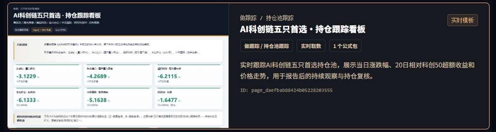
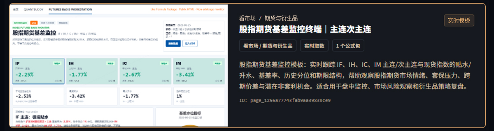
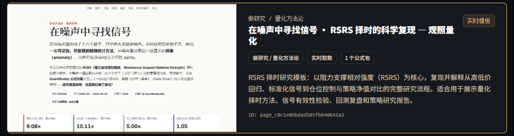
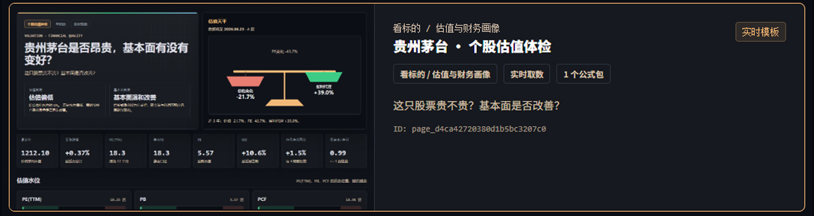
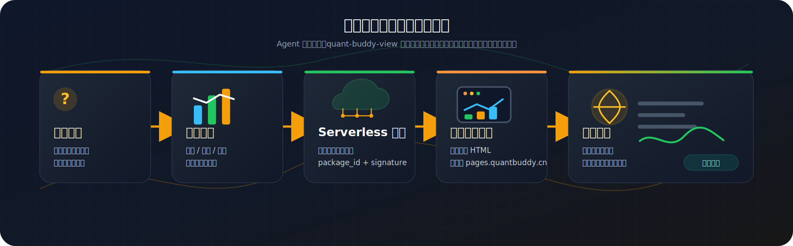

# quant-buddy-view

<p align="center">
  
</p>

<p align="center">
  <a href="README.md">中文</a> ·
  <a href="README.en.md">English</a> ·
  <a href="#30-秒看明白">30 秒看明白</a> ·
  <a href="#快速开始">快速开始</a> ·
  <a href="https://www.quantbuddy.cn">官网</a>
</p>

<p align="center">
  <a href="https://github.com/pseudo-longinus/quant-buddy-view/stargazers"></a>
  <a href="https://github.com/pseudo-longinus/quant-buddy-view/blob/main/LICENSE"></a>
  
  
  
  
</p>

<p align="center">
  <strong>做宽宝活页，搭投研沙盘</strong>
</p>

<p align="center">
  把你的投研想法——选股、择时、估值、追踪——用一句话交给 AI Agent，<br/>
  变成可分享、可改进、会自动更新的<strong>活页</strong>；再把活页聚成属于你自己的<strong>投研沙盘</strong>。
</p>

> 本项目用于金融数据分析、量化研究、策略验证和教育用途，不构成投资建议、交易建议、收益承诺或自动交易服务。

## 它解决什么问题

**「我想学基本面、财务、宏观、量化这些投研范式，怎么快速上手？」**

宽宝提供范式地图，一张活页即一个投研范式，可更新，可修改，可回测， 照着它的公式改成自己的，边用边学。

**「我想把一堆个股聚合成行业指标，最短平快的做法是什么？」**

一句话让 Agent 注册聚合公式包，通过宽宝云自动把个股算成行业指标活页。

**「我想把一个投资想法，一句话变成可分享、可改进、自动更新的投研系统？」**

把想法说给 Agent，它就帮你验证公式、注册接口、发布成可分享的自更新活页。数据免费。

**「我想把关注的指标做成个性化页面，电脑关机也能随时看？」**

活页可以托管在云端，发个链接，任何设备打开都是最新，电脑不用开。也可以一个本地html带着走，能上网就能看

> 这一切的成本很轻：**托管免费、访问免费**，只在需要服务端重算时才计费，每天更新低至几分钱（**当前限时免费**）。

## 理念：视图即范式

- **视图即范式**：每一张活页都是一套可运行、可复现、可改进的投研范式，而不是一张会过期的截图。
- **开放社区**：活页可以被打开、复制、改成自己的版本，好范式在社区里流动、被持续打磨。
- **人人都能搭自己的投资体系**：从一张活页开始，聚成属于你的投研沙盘——**做宽宝活页，搭投研沙盘**。

## 30 秒看明白

你不需要写代码，只要对装好 skill 的 Agent 说一句话：

```text
用 quant-buddy-view 做一个沪深300、中证1000、纳斯达克100和黄金近一年的收益风险比较活页，
展示累计收益、最大回撤、波动率和相关性，发布成可分享、会自动更新的链接。
```

Agent 在后台完成三件事，然后把链接交给你：

```text
1. 用公式验证你的选股 / 估值 / 回测逻辑
2. 注册一组专属的 Serverless 数据接口（公式任务包）
3. 生成 HTML 并发布到 pages.quantbuddy.cn
```

结果是一个**打开即最新**的网页链接：发到群里、嵌进公众号，别人点开看到的永远是当天的数据，而不是一张过期截图。

更多可以直接复制的一句话需求，见下面的 [快速开始](#快速开始)。

## 真实活页示例：打开就是最新

下面这些来自 [QuantBuddy 模板市场](https://www.quantbuddy.cn/templates) 的页面都是**活页**——不是静态 PPT，也不是空模板，而是可打开、可复用、会实时取数的页面；点击截图即可查看线上样例。

<table align="center">
  <tr>
    <td align="center" width="50%">
      <a href="https://pages.quantbuddy.cn/pages/skill_1773824558486_02dfce/page_973ce4a8bff9a7bbd814f11c.html"></a>
      <br/><sub><b>全球资产泡沫监测</b> · 看市场 · 实时 2 公式包</sub>
    </td>
    <td align="center" width="50%">
      <a href="https://pages.quantbuddy.cn/pages/page_221a3ffae084d983d1b509d4.html"></a>
      <br/><sub><b>A股涨跌停结构复盘</b> · 看市场 · 实时 1 公式包</sub>
    </td>
  </tr>
  <tr>
    <td align="center" width="50%">
      <a href="https://pages.quantbuddy.cn/pages/page_4b488204774ddb45739d39cc.html"></a>
      <br/><sub><b>科创板 AI 硬科技组合</b> · 管组合 · 实时 3 公式包</sub>
    </td>
    <td align="center" width="50%">
      <a href="https://pages.quantbuddy.cn/pages/page_1256a77743fab9aa39838ce9.html"></a>
      <br/><sub><b>股指期货基差监控终端</b> · 看市场 · 实时 1 公式包</sub>
    </td>
  </tr>
  <tr>
    <td align="center" width="50%">
      <a href="https://pages.quantbuddy.cn/pages/page_c0c1e05bdad501fbb40641a3.html"></a>
      <br/><sub><b>在噪声中寻找信号 · RSRS 研究</b> · 做研究 · 实时 1 公式包</sub>
    </td>
    <td align="center" width="50%">
      <a href="https://pages.quantbuddy.cn/pages/page_d4ca42720380d1b5bc3207c0.html"></a>
      <br/><sub><b>贵州茅台 · 个股估值体检</b> · 看标的 · 实时 1 公式包</sub>
    </td>
  </tr>
</table>

## 快速开始

最快的成功路径就三步：

1. 去 [www.quantbuddy.cn](https://www.quantbuddy.cn) 申请一个 API Key。
2. 对装好 skill 的 Agent 说一句话：**「用 quant-buddy-view 做一个 ⟨你关注的投研问题⟩ 页并发布，我的 key 是 ⟨你的 key⟩」**。
3. Agent 返回一个可打开、属于你自己的活页链接。

> 下面是 skill 安装、API Key 配置和模板改造的详细步骤；想从官方活页改起，也可以先在 [模板市场](https://www.quantbuddy.cn/templates) 选一个再让 Agent 改造。

### 1. 安装 skill

按你使用的 Agent 选择一条命令：

```bash
# Claude Code
npx skills add pseudo-longinus/quant-buddy-view -g -a claude-code -s quant-buddy-view -y

# Cursor
npx skills add pseudo-longinus/quant-buddy-view -g -a cursor -s quant-buddy-view -y

# OpenClaw
npx skills add pseudo-longinus/quant-buddy-view -g -a openclaw -s quant-buddy-view -y
```

Windows 用户如遇 symlink（符号链接）或权限错误，可追加 `--copy`：

```bash
npx skills add pseudo-longinus/quant-buddy-view -g -a claude-code -s quant-buddy-view -y --copy
```

已安装用户更新：

```bash
npx skills update quant-buddy-view -g -y
```

实时取数页面还需要 `quant-buddy-skill` 先验证公式是否真实出数。如果 Agent 提示缺少 companion skill，可让 Agent 按提示安装，或直接安装 / 刷新 Quant Buddy skills bundle：

```bash
npx skills add pseudo-longinus/quant-buddy-skills -g --all
# 已安装、只需刷新时
npx skills update pseudo-longinus/quant-buddy-skills -y
```

第一次使用 Agent / skill，可以按[图文教程](https://tcn8bvcbyokw.feishu.cn/wiki/E1zswck3oiiJjJkP07QcmSG3nle?from=from_copylink)一步步展开。

### 2. 配置 API Key

首次使用前需要配置 quant-buddy API Key：

1. 前往 <https://www.quantbuddy.cn/login> 注册并获取 API Key。
2. 推荐设置环境变量 `QUANT_BUDDY_API_KEY`。
3. 也可以在 skill 目录下创建 `skills/quant-buddy-view/config.local.json`，写入本地 Key。
4. 或直接在支持本地文件写入的 Agent 对话中发送：

```text
帮我配置 quant-buddy API Key：<你的 API Key>
```

> 注册公式包、上传页面、更新页面需要 API Key；已发布活页内的实时取数不需要 API Key。不要把真实 Key 写进公开仓库。

### 3. 直接让 Agent 发布

安装并配置完成后，可以直接对 Agent 说：

```text
用 quant-buddy-view 套用 QuantBuddy 模板市场里的「全球资产泡沫监测」模板，
替换成我关注的资产和指标，
注册我自己的公式包，
并发布成一个可分享、会自动更新的活页。
```

也可以换成更具体的需求：

```text
用 quant-buddy-view 做一个贵州茅台的估值体检活页，
页面参考模板市场里的「贵州茅台 · 个股估值体检」，
用我的公式重新注册数据接口，
发布后给我公开链接。
```

Agent 会先用 `quant-buddy-skill` 验证行情、财务、因子或回测公式，再用 `quant-buddy-view` 注册 Serverless 数据接口并发布页面。

## 工作原理

<p align="center">
  
</p>

这个设计的关键点：

| 设计点 | 说明 |
|---|---|
| 静态页面 | 发布出去的是 HTML，不需要你维护服务器、数据库或定时任务 |
| Serverless 公式任务包 | 每张活页背后是一组专属公式和读取模式，按你的问题定制 |
| 实时取数 | 页面打开时调 `queryFormulaPackage`，底层数据更新后访问者看到最新结果 |
| API Key 不进前端 | 前端只拿 `signature` 取数；API Key 只用于注册、发布和管理 |
| URL 可长期分享 | 改页面内容时用 `update` 覆盖同一个 `page_id`，原链接不变 |

## 官方活页与自定义活页

### 官方模板市场

真正可复用的公共活页在 [QuantBuddy 模板市场](https://www.quantbuddy.cn/templates)，由平台接口实时下发，不是写死在本仓库里。每个活页都可以：

| 动作 | 用途 |
|---|---|
| 预览样例 | 先确认页面是否匹配你的问题 |
| 下载活页 HTML | 复用页面结构和交互 |
| 复制提示词 | 交给 Agent 按你的目标改造 |
| 替换公式包 | 把模板作者的数据源换成你的公式任务包 |
| 上传发布 | 生成属于你的公开页面 |

### 不再内置离线 examples

本仓库不再内置离线 examples 作为页面起点，也不会把旧版 demo HTML 打包进 skill。固定页面形态默认从模板市场 / 在线模板接口获取：Agent 先筛选公共活页，下载模板 HTML，验证并注册你自己的公式包，再替换文案和凭证后发布成你的链接。

### 自定义活页

官方公共活页是默认起点。如果模板市场没有合适页面，再让 Agent 定制一张专属活页，并通过 quant-buddy-view 发布成同样可分享、会实时更新的链接。自定义页面只写主体内容，页头、页尾、刷新按钮和分享海报弹层统一由 `assets/share-shell/` 提供；进阶做法见 `skills/quant-buddy-view/guides/bespoke-page.md`。

## 页面维护

| 你要做什么 | 命令 |
|---|---|
| 页面已分享，想改内容但保留原链接 | `python scripts/static_page.py update '{"page_id":"page_xxx","html_file":"output/pages/new.html"}'` |
| 数据更新了，想让页面显示最新值 | 什么都不用做；访问者打开页面时实时取数 |
| 下线页面 | `python scripts/static_page.py revoke '{"page_id":"page_xxx"}'` |
| 轮换公式包签名 | `python scripts/formula_package.py refresh '{"package_id":"pkg_xxx","rotate_signature":true}'` |
| 给页面设置缩略图 | `python scripts/static_page.py thumbnail '{"page_id":"page_xxx","image_file":"cover.png"}'` |

`update` 是已分享页面的常用维护方式：它替换同一个 `page_id` 的 HTML，URL 不变，也不占新的活跃页配额。

## 运行环境

- **Python 3.8+**：核心流水线（注册、生成、发布）仅依赖 Python 标准库，无需 `pip install`。
- **Node.js 18+（建议安装）**：用于 `scripts/verify_page.mjs` 发布前页面验收。
- **Playwright / Chrome / Edge（建议至少有一个）**：`verify_page.mjs` 优先用 Playwright；缺失时会尝试系统 Chrome / Edge。发布前请使用 `--require-browser`，如果结果是 `static-only`，不能算完整浏览器验收。

## 计费

quant-buddy-view 的计费口径很简单：**托管免费，访问免费，只在需要服务端计算/更新时计 RU**。

| 场景 | 是否消耗 RU |
|---|---|
| 访问者打开已发布页面 | 不按 PV 计费 |
| 页面托管在 `pages.quantbuddy.cn` | 免费托管 |
| 下载活页 HTML / 复制提示词 | 不消耗 RU |
| 注册公式任务包、刷新公式包、轮换签名、更新需要重算的数据 | 按公式条数、数据量和计算复杂度计 RU |

> 当前处于限时免费体验中：创建和刷新活页暂不消耗 RU。免费期结束后，复杂计算会按 RU 消耗，每天第一次更新通常低至几分钱；费用计入公式包所有者的配额，访问者免 API Key、零配置打开。实际消耗以平台账户页和接口返回为准。

## 安全与免责声明

- quant-buddy API Key 仅用于请求 quant-buddy 平台接口，只作为 HTTP `Authorization` 头发送到平台声明域名，不写入日志、不转发第三方。
- 自建服务时，API Key 必须放在服务端，不要写进浏览器代码或公开仓库；仓库内 `config.json` 的 `api_key` 默认为空，真实 Key 放 `config.local.json`（已被 .gitignore 忽略）或环境变量。
- `signature` 是公式包能力令牌，设计上会写进公开 HTML 供实时取数；发布前请确认页面内容与可公开范围。
- 本项目用于金融数据分析、量化研究、策略验证和教育用途，不构成投资建议、交易建议、收益承诺或自动交易服务。
- 回测、筛选、因子和历史数据不代表未来收益。

## 交流与反馈

- **Bug 或功能建议**：欢迎提交 [GitHub Issue](https://github.com/pseudo-longinus/quant-buddy-view/issues)。
- **活页案例、接入与投研工作流讨论**：见 [官网](https://www.quantbuddy.cn)。
- **实时交流群**：扫码添加微信或加入微信 / 飞书群（下方展开）。

<details>
<summary>微信 / 飞书交流群二维码</summary>

<p align="center">
  <table>
    <tr>
      <td align="center">
        
        <br/>
        <sub>个人微信</sub>
      </td>
      <td align="center">
        
        <br/>
        <sub>微信群</sub>
      </td>
      <td align="center">
        
        <br/>
        <sub>飞书群</sub>
      </td>
    </tr>
  </table>
  <br/>
  <sub>扫码添加微信或加入交流群，欢迎交流量化数据活页、AI Agent 工作流和策略验证案例。</sub>
</p>

</details>

## Star History

<a href="https://www.star-history.com/?repos=pseudo-longinus%2Fquant-buddy-view&type=date&legend=top-left">
 <picture>
   <source media="(prefers-color-scheme: dark)" srcset="https://api.star-history.com/chart?repos=pseudo-longinus/quant-buddy-view&type=date&theme=dark&legend=top-left" />
   <source media="(prefers-color-scheme: light)" srcset="https://api.star-history.com/chart?repos=pseudo-longinus/quant-buddy-view&type=date&legend=top-left" />
   
 </picture>
</a>

## License

MIT
